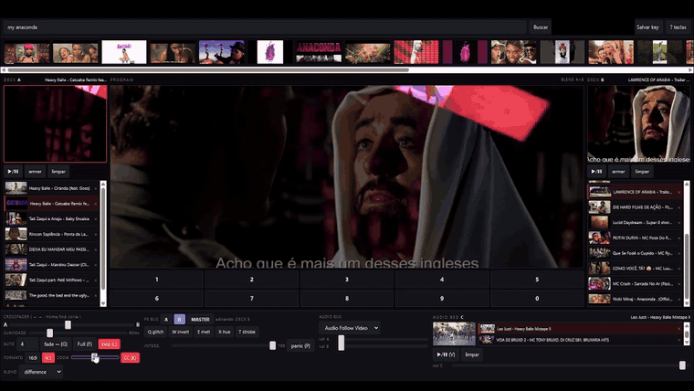

# Taller VJ

A live audiovisual sampler that turns YouTube into a VJ instrument. Search, drag, cue,
trigger, crossfade, and process video in real time — from a single HTML file, in your browser.

Built for playing, not for broadcasting. See [Scope and limits](#scope-and-limits).




*Two decks mixed in `difference` blend, deck monitors on both sides, hot slots below the
Program, audio bed bottom right.*

## What it does

The program lives in its own window (`output.html`), meant to be dragged onto a projector or
second screen and put fullscreen. The controller window keeps the library, the deck monitors,
the mixer, and a **cue player that never reaches the output** — you can watch, scrub and
audition anything mid-performance without it going on air, then send it to a deck from the
exact point you were watching.

Two video decks (A and B) play simultaneously into the composited output, with independent
muted monitors for each deck in the controller. A third deck is audio-only — drop a long set
or a playlist there and it plays underneath everything, advancing on its own.

Effects run on three independent buses: deck A, deck B, and the master (the already-mixed
composition). Each bus has its own intensity control. The crossfader has adjustable inertia
and an automatic timed fade. Output can be framed as 16:9 or 4:3, cropping to fill rather
than distorting, with an extra zoom on top.

Everything is keyboard-driven, because a mouse is not an instrument.

## Requirements

A Chromium-based browser, Python (only to serve the file), and optionally a YouTube Data
API key for in-app search.

## Running

The page **must be served over HTTP** — YouTube embeds refuse to play from `file://`.

On Windows, double-click `start-vj.bat`. It serves the folder and opens the browser.

Anywhere else:

```bash
python -m http.server 8787
```

Then open <http://localhost:8787/youtube-vj.html> and press `O` to raise the output window.
Nothing reaches the screen until that window is open — the decks live in it.

## Loading video

Paste a YouTube URL or an 11-character video ID into the search box and press Enter — this
works with no API key and no quota. Paste a URL containing `list=` to load a whole playlist.

For search inside the app, create a free API key: go to the
[Google Cloud Console](https://console.cloud.google.com), create a project, enable
**YouTube Data API v3**, then create an API key under Credentials. Paste it into the field
and click *Salvar key*; it is stored in your browser's `localStorage` and never leaves it.
Restrict the key to `http://localhost:8787/*` and to the YouTube Data API.

The key is stored in this browser's `localStorage` and is never written to disk by the
project, never sent anywhere except Google's API, and never committed — the field is masked
and only reveals on demand, for a few seconds.

Note the quota: 10,000 units per day, and each search costs 100 — about a hundred searches
daily. Pasting URLs costs nothing.

## Controls

| Key | Action |
| --- | --- |
| `O` | open the output window (drag to the projector, then F11) |
| click | load a search result into the cue player (never on air) |
| `[` `]` | send the cue to deck A / deck B, from where you were watching |
| `/` | collapse or open the search strip |
| drag | drop a search result onto column A/B, a numbered slot, or the Audio Bed |
| `0`–`9` | fire hot slot into the armed deck |
| `Shift`+`0`–`9` | store the selected result in a slot |
| `Tab` | switch armed deck |
| `Space` | play/pause armed deck |
| `←` `→` | crossfade · `Home`/`End` hard cut |
| `G` | automatic timed fade |
| `Z` `X` `C` | select effect bus: deck A, deck B, master |
| `Q` `W` `E` `R` `T` | glitch, invert, melt, hue, strobe (on the selected bus) |
| `P` | panic — drop every effect on every bus |
| `L` | loop toggle (on by default) · `K` captions toggle (off by default) |
| `V` | play/pause the Audio Bed |
| `F` | fullscreen Program · `Esc` exit |

Right-clicking a slot also stores the selected result. Deck libraries, slots, loop state,
frame format, and the API key persist in `localStorage`.

## Scope and limits

This is a local toy, and the design follows from one hard constraint: the YouTube player
runs in a **cross-origin iframe**, so its pixels cannot be read.

That means effects are CSS filters and blend modes applied over the layer, not real frame
processing — no shaders, no feedback, no true pixelation, no chroma key. It also means a
player cannot be mirrored in two places, so each deck's side monitor is a *second copy* of
the same video, muted, at low quality, kept aligned by periodic seeking. Expect a few tenths
of a second of drift, and expect five simultaneous players to cost bandwidth and CPU.

Many videos, especially music channels, disable embedding. In-app search filters those out;
pasted URLs do not, so a silent deck is usually a blocked embed.

**Do not stream or record this.** The tool modifies and overlays the YouTube player, which
the YouTube API Developer Policies do not allow in published products, and broadcasting
other people's video is a copyright matter independent of any platform's terms. Run it
locally, play with it, project it in a room. That is what it is for.

## License

MIT — see [LICENSE](LICENSE). The license covers this software only, not any content played
through it.

---

Taller Dev 2026 · Taller Laboratório Fotoquímico
