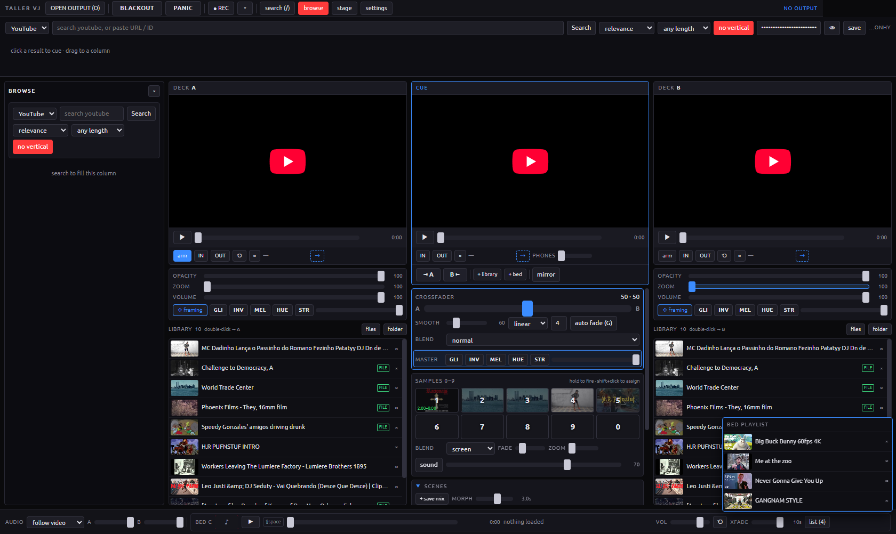

# Babel VJ

**A video performance desk. The internet is the library.**

Search YouTube and the Internet Archive, cue anything without it reaching the screen,
throw it to a deck, crossfade, loop the good part, fire samples off the number row, and
record the whole thing. A desktop app — no browser, no server to start.

*A Taller software.* Made at Taller Laboratório Fotoquímico, where the day job is
preserving film. This is the same instinct pointed at moving images that already live
online: a hundred thousand hours of public-domain footage nobody is watching.



*Three columns: deck A, cue and mixer, deck B. Browse column open on the left, audio
plane along the bottom.*

---

## Install

Download the latest release and run it. Windows x64:

- **`BabelVJ-1.0.0-setup.exe`** — installs, creates a shortcut, lets you pick the folder.
- **`BabelVJ-1.0.0-portable.exe`** — no install, runs from anywhere, including a stick.

The installer is not code-signed, so Windows SmartScreen will warn about an unknown
publisher: *More info → Run anyway*. Signing needs a paid certificate.

macOS and Linux are not built yet. The code has nothing Windows-specific except the
system-audio capture, so a build there is plausible — it has simply never been tried.

## First five minutes

1. Open the app. **The screen stays black until you ask for it** — press `O` or click
   **OPEN OUTPUT**. A second window appears; on a two-screen setup it goes fullscreen on
   the projector by itself.
2. Press `/` and paste a YouTube URL, or an 11-character video ID, into the search box.
   Pasting costs nothing and needs no key.
3. Click the result. It lands in the **cue** — the middle player, which never reaches the
   output. Watch it, scrub it, find the good part.
4. Press `[` to send it to deck A **from where you were watching**.
5. Press `Space` to play, `→` to crossfade towards it.

That is the whole loop of the instrument: *find, audition in private, send, mix*.

There is a longer, hands-on walkthrough in **[TUTORIAL.md](TUTORIAL.md)**.

## What is in the box

**Two video decks and a cue.** Decks A and B play at once into the composed output. The
cue is a third player wired to nothing — the only place where you can look before the room
does.

**A single library.** Everything you add lands in one pool, shown beside both decks. A
folder of clips is a folder of clips; which deck it goes to is decided at the moment you
throw it, not at import.

**Two sources, plus your disk.** YouTube for what everyone has, the Internet Archive for
what nobody watches. Archive items can be **downloaded** with one button and swap to local
playback *while still on air* — the picture never stops, the network stops mattering.
Local files (`mp4`, `webm`, `mkv`, `mov`, `avi`, `m4v`, `ogv`) import by file or by folder.

**A mixer that behaves.** Crossfader with adjustable inertia and three curves, blend modes
between the decks, per-deck opacity, zoom, framing (pan, rotate, mirror, edge crop), and
an automatic timed fade. `BLACKOUT` and `PANIC` sit in the top bar in a bigger typeface,
because you reach for them without looking.

**Effects on three buses.** Deck A, deck B, and the master — glitch, invert, melt, hue,
strobe, each with its own amount. Switch the render engine to WebGL in settings and local
files gain real shaders: pixelate, RGB split, kaleidoscope, feedback.

**Samples on the number row.** Slots preloaded and paused, fired by holding `0`–`9` and
gone when you let go. They take YouTube, Archive and local files alike.

**An audio bed.** A separate audio-only player with its own playlist, loop or sequential,
with a volume crossfade between tracks so it never cuts dry. `Shift+Space` plays it.

**The picture can listen.** Capture the system audio or an input, and route bands or the
detected beat into any parameter. Tap tempo, BPM, and four LFO shapes are there too. A
modulated control changes colour and moves on its own, so you can see what is driving it.

**Scenes.** `F1`–`F8` store and recall the *mix* — fader, opacity, zoom, framing, effects,
samples — and never the content. Calling a scene mid-track does not cut the image.
`Shift`+the key records over it. Transitions interpolate up to 5 seconds.

**Recording.** Capture the output window, the controller window, or both as two separate
files, with system sound, adjustable bitrate, and a folder of your choosing. It records the
*window*, so whatever plays there ends up in the file.

**Text on the projection**, fixed, scrolling or blinking, with an outline.

**Sessions** save and reopen as a JSON file — library, slots, scenes, routes. The API key
is never written into it.

## The search key

Pasting URLs and using the Internet Archive need no key at all. Searching *inside* YouTube
does: create one free at the [Google Cloud Console](https://console.cloud.google.com) —
new project, enable **YouTube Data API v3**, then Credentials → API key. Paste it into the
field in the search strip and press **save**.

It lives in this machine's `localStorage`, is sent only to Google, is masked in the
interface, and is never written to a session file or committed. The daily quota is 10,000
units and a search costs 100 — about a hundred searches a day.

## Keys

| Key | Action |
| --- | --- |
| `O` | open the output window |
| `/` | search strip · `Ctrl+F` browse column |
| click | send a result to the cue (never on air) |
| `[` `]` | cue → deck A / deck B, from the point you were watching |
| `Tab` | switch the armed deck |
| `Space` | play/pause the armed deck · `Shift+Space` the audio bed |
| `←` `→` | crossfade · `Home` `End` hard cut to A / B |
| `G` | automatic timed fade |
| `0`–`9` | hold to fire a sample · `Shift`+digit to store one |
| `Z` `X` `C` | effect bus: deck A, deck B, master |
| `Q` `W` `E` `R` `T` | glitch, invert, melt, hue, strobe on the selected bus |
| `B` | blackout · `P` panic, drops every effect |
| `F1`–`F8` | recall a scene · `Shift`+key records over it |
| `F9` | stage mode: hides preparation, enlarges what you play with |
| `L` | loop · `K` captions · `V` audio bed |

## Limits worth knowing before the party

**YouTube runs in a cross-origin iframe.** Its pixels cannot be read, so effects on
YouTube decks are CSS filters and blend modes over the layer — not frame processing. WebGL
shaders only reach local files. It also means a player cannot be mirrored: each deck
monitor is a second, muted, low-quality copy kept aligned by seeking, so expect a few
tenths of a second of drift.

**The Internet Archive streams from one datacentre** and can stutter live. That is what
the download button is for. Some items advertise an MP4 that has no playable derivative;
they fail to load and there is nothing to do about it from here.

**archive.org sends no CORS header**, so a remote Archive source cannot enter the WebGL
pipeline — it falls back to DOM rendering by itself instead of flashing black.

**Many videos disable embedding**, music channels especially. In-app search filters them
out; a pasted URL does not, so a deck that stays silent is usually a blocked embed.

**Playing is not broadcasting.** This tool overlays and modifies the YouTube player, which
the platform's developer policies do not allow in a published product, and projecting other
people's video is a copyright matter of its own. Run it locally, play with it, light up a
room. That is what it is for.

## Building from source

```bash
cd app && npm install && npm start
```

| Command | What it does |
| --- | --- |
| `npm start` | build and run |
| `npm run dev` | Vite with hot reload plus Electron |
| `npm run typecheck` | TypeScript, no emit |
| `npm run selftest` | drives the real app end to end and prints a JSON report |
| `npm run dist` | installer and portable build into `app/release` |

`npm run selftest` is the honest gate: it opens both windows, plays real videos, records,
downloads, saves a scene and reports what it found. It also writes
`%TEMP%/taller-vj-selftest.json`, which is how a packaged build gets checked.

Stack: Electron, React, TypeScript, Vite, Zustand. Architecture notes for anyone (or any
agent) working on the code live in [AGENTS.md](AGENTS.md); the visual identity, palette and
symbol set are documented in [brand/README.md](brand/README.md).

## Legacy

Version 0 was a single HTML file served over `python -m http.server`. It is kept in
[`legacy/`](legacy/) for the record and receives nothing — no fixes, no features. **The app
is the project.** Anything the old page did, this does better, and it does a great deal the
page could not: local files, shaders, recording, scenes, the Archive, an audio bed.

## License

MIT — see [LICENSE](LICENSE). It covers this software only, never the content played
through it. The Ubuntu typeface ships under the Ubuntu Font Licence 1.0
(`app/src/assets/fonts/UFL-1.0.txt`).

---

Taller Laboratório Fotoquímico · 2026
